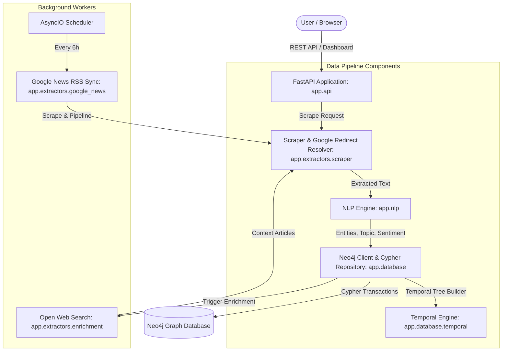

# OSINT Intelligence Engine 🕸️🤖

A technical blueprint and implementation of an automated Open Source Intelligence (OSINT) pipeline. It scrapes web articles, decodes publisher redirects, extracts named entities and sentiment via NLP, constructs a temporal graph hierarchy, and maps network relationships in Neo4j.

---

## 🎯 Rebuilding from Scratch: System Mental Model

To understand or rebuild this engine from scratch, follow its 5 core pipeline stages:

1. **Ingestion & Redirect Resolution:** Web scraping with rotated User-Agents combined with Google News internal `batchexecute` URL decoding (`garturlreq` RPC) to resolve raw publisher URLs.
2. **NLP Extraction Engine:** Named Entity Recognition (`PERSON`, `ORG` ➔ `Company`, `GPE` ➔ `Location`) using spaCy (`en_core_web_sm`), corporate suffix normalization (`Inc.`, `LLC`, `Corp.`), domain topic classification (`Technology`, `Finance`, `Geopolitics`, etc.), and 2-word sentiment negation handling.
3. **Paragraph Proximity Engine:** Grouping and linking entity relationships mentioned within the exact same paragraph (`\n\n`) to prevent global network false positives.
4. **Temporal Hierarchy Engine:** Constructing a time tree (`Year` ➔ `Month` ➔ `Week` ➔ `Day` ➔ `TimePeriod` ➔ `Article`) linked to 6-hour interval bins for time-sliced graph queries.
5. **Graph Query & Vis.js Pathfinder UI:** High-speed Cypher queries (<415ms), shortest-path calculation (up to 6 hops), and paragraph/sentence-level evidence extraction for dashboard overlays.

---

## 🏗️ System Architecture & Component Mapping



---

## 🧩 Key Modules & Responsibilities

| Module | Location | Purpose / How to Rebuild |
| :--- | :--- | :--- |
| **API Layer** | `app/api/` | FastAPI routers (`graph.py`, `ingestion.py`) with 503 error handling for offline DB states. |
| **Scraper & Resolver** | `app/extractors/scraper.py` | BeautifulSoup article parser & Google News `batchexecute` RPC (`garturlreq`) decoder. |
| **NLP Pipeline** | `app/nlp/` | spaCy model loader (`model.py`), topic classification (`classification.py`), suffix stripper (`text_processing.py`). |
| **Temporal Engine** | `app/database/temporal.py` | Date parser building `Year`/`Month`/`Week`/`Day`/`TimePeriod` IDs and paragraph context matchers. |
| **Graph Repository** | `app/database/repository.py` | Cypher transaction methods for node batching, graph payloads, and shortest paths. |
| **Background Sync** | `app/extractors/` | `google_news.py` for 6h RSS crawls; `enrichment.py` for web searching top company entities. |

---

## 📊 Neo4j Graph Database Schema

If recreating the graph database, enforce the following node types and Cypher relationships:

### Node Labels & Unique Constraints
* `Organization` (`name` - Unique) — Workspace container
* `Article` (`title` - Unique, `url`, `body`, `category`, `sentiment`, `created_at`)
* `Person` (`name` - Unique), `Company` (`name` - Unique), `Location` (`name` - Unique)
* `Year` (`id`), `Month` (`id`), `Week` (`id`), `Day` (`id`), `TimePeriod` (`id`)

### Relationship Schema
```cypher
(:Article)-[:UNDER_WORKSPACE]->(:Organization)
(:Person|Company|Location)-[:MENTIONED_IN]->(:Article)
(:Person)-[:INDIRECTLY_INVOLVED_WITH]->(:Company)  // Linked via paragraph proximity
(:Person)-[:LOCATED_IN]->(:Location)               // Linked via paragraph proximity
(:TimePeriod)-[:HAS_ARTICLE]->(:Article)
(:Year)-[:HAS_MONTH]->(:Month)-[:HAS_WEEK]->(:Week)-[:HAS_DAY]->(:Day)-[:HAS_PERIOD]->(:TimePeriod)
```

---

## 🚀 Quick Start & Rebuilding Setup

### 1. Run full stack via Docker Compose
```bash
docker-compose up --build
```
* **Dashboard:** `http://localhost:8000`
* **Swagger API Docs:** `http://localhost:8000/docs`
* **Neo4j Console:** `http://localhost:7474` (User: `neo4j`, Password: `secure_password_123`)

### 2. Local Development Setup
```bash
python -m venv .venv
.venv\Scripts\activate      # Windows: .venv\Scripts\activate | macOS/Linux: source .venv/bin/activate
pip install -r requirements.txt
uvicorn app.main:app --reload --port 8000
```

---

## 📂 Codebase Directory Layout

```text
intelligence-engine/
├── app/
│   ├── api/        # REST routers: /api/graph, /api/scrape, /api/path, /api/stats
│   ├── core/       # Global config (env vars, ThreadPoolExecutor, logging)
│   ├── database/   # Neo4j singleton, Cypher repository, & temporal tree builder
│   ├── extractors/ # Web scraper, Google News decoder, & background enrichment
│   ├── nlp/        # spaCy entity resolution, topic, & sentiment pipelines
│   ├── static/     # Front-end Vis.js dashboard, app.js logic, & CSS styling
│   └── main.py     # FastAPI application lifespan, scheduler, & router mounts
├── Dockerfile
├── docker-compose.yml
├── requirements.txt
└── README.md
```


