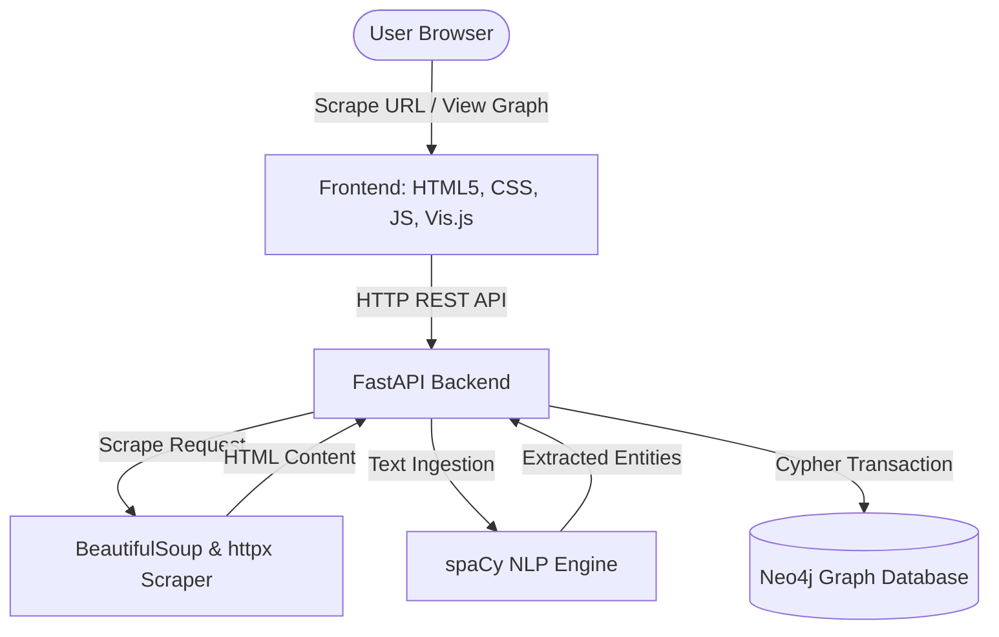

# OSINT Intelligence Engine 🕸️🤖

An automated, dockerized OSINT (Open Source Intelligence) pipeline that scrapes web articles, extracts entities (People & Organizations) using Natural Language Processing (NLP), and maps their relationship networks in a dynamic Neo4j Graph Database.

---

## 🌟 Features

*   **Automated Web Scraper:** Custom BeautifulSoup ingestion pipeline that extracts article titles and bodies, sanitizing navigation elements, scripts, ads, and boilerplate text.
*   **NLP Entity Extraction:** Employs a pre-trained **spaCy** model (`en_core_web_sm`) to classify named entities (specifically `PERSON` and `ORG` tags).
*   **Graph Network Storage:** Resolves entities to a schema of `Organization`, `Article`, `Person`, and `Company` nodes in **Neo4j** with semantic relationships:
    *   `(:Article)-[:UNDER_WORKSPACE]->(:Organization)`
    *   `(:Person|Company)-[:MENTIONED_IN]->(:Article)`
    *   `(:Person)-[:INDIRECTLY_INVOLVED_WITH]->(:Company)`
*   **Interactive Dashboard:** A premium, dark-mode dashboard featuring:
    *   Dynamic Workspace switcher.
    *   Key metrics counts (Articles, People, Companies).
    *   Live log of recently processed articles.
    *   **Vis.js Network** visualization of the intelligence graph with physics simulation controls.

---

## 🏗️ Architecture



---

## 🚀 Quick Start with Docker

The easiest way to run the entire stack is using **Docker Compose**, which provisions both the Neo4j Graph Database and the FastAPI backend.

### 1. Build and Start Services
From the project root directory, run:
```bash
docker-compose up --build
```

This will:
1. Initialize the Neo4j instance at `bolt://localhost:7687` (Username: `neo4j`, Password: `secure_password_123`).
2. Build the backend image, automatically download the required spaCy models, and launch the server on port `8000`.

### 2. Access the Application
*   **Interactive Dashboard:** Open your browser and navigate to [http://localhost:8000](http://localhost:8000)
*   **FastAPI Interactive Documentation (Swagger UI):** Visit [http://localhost:8000/docs](http://localhost:8000/docs)
*   **Neo4j Browser Console:** Visit [http://localhost:7474](http://localhost:7474)

### 3. Build & Run the Backend Container Standalone (Dockerfile)
If you want to build and run the backend FastAPI container independently (without Docker Compose):

*   **Build the Image:**
    ```bash
    docker build -t osint-backend -f Dockerfile .
    ```
*   **Run the Container:**
    Run the container while passing the Neo4j credentials and host URI pointing to your database instance:
    ```bash
    docker run -d -p 8000:8000 --name osint-backend -e NEO4J_URI=bolt://<neo4j-host>:7687 -e NEO4J_USER=neo4j -e NEO4J_PASSWORD=secure_password_123 osint-backend
    ```

---

## 🛠️ Local Development Setup

If you prefer to run the backend locally (outside of Docker) with a local/remote Neo4j instance:

### Prerequisites
*   Python 3.10+
*   An active Neo4j database instance

### 1. Set Up Virtual Environment
```bash
python -m venv .venv
.venv\Scripts\activate      # On Windows
source .venv/bin/activate    # On macOS/Linux
```

### 2. Install Dependencies
```bash
pip install -r requirements.txt
```

### 3. Download the spaCy NLP Model
```bash
python -m spacy download en_core_web_sm
```

### 4. Configure Environment Variables
Create a `.env` file or export the following variables in your terminal:
```env
NEO4J_URI=bolt://localhost:7687
NEO4J_USER=neo4j
NEO4J_PASSWORD=secure_password_123
```

### 5. Start the FastAPI Server
```bash
uvicorn app.main:app --reload --host 0.0.0.0 --port 8000
```

---

## 🔌 API Reference

### 🌐 Workspace Management & Stats
*   `GET /api/organizations` - Retrieves all active workspace/organization nodes.
*   `GET /api/stats?org={org_name}` - Fetches node counters (Articles, People, Companies) under a workspace.
*   `GET /api/recent?org={org_name}` - Retrieves the 20 most recently ingested articles.

### 🕸️ Relationship Graph
*   `GET /api/graph?org={org_name}` - Generates the node-edge payload structured for vis.js rendering.

### 📩 Data Ingestion
*   `POST /api/scrape`
    *   **Payload:** `{ "url": "string", "org": "string" }`
    *   **Description:** Performs synchronous URL extraction, then pushes entity processing to background tasks.
*   `POST /process-news`
    *   **Payload:** `{ "title": "string", "body": "string", "org": "string" }`
    *   **Description:** Manually ingests pre-extracted text into the NLP pipeline.

---

## 📂 Project Directory Structure

```text
intelligence-engine/
│
├── app/
│   ├── static/                 # Front-end Assets
│   │   ├── app.js              # State management & Vis.js rendering
│   │   ├── index.html          # Dashboard Layout
│   │   └── style.css           # Premium Dark Mode Theme
│   │
│   ├── __init__.py
│   ├── database.py             # Neo4j Cypher Transaction Handlers
│   ├── main.py                 # FastAPI Application Config & Endpoints
│   ├── nlp.py                  # spaCy Entity Extraction Logic
│   └── scraper.py              # BeautifulSoup Article Scraper
│
├── Dockerfile                  # Multi-stage production-ready build for Python app
├── docker-compose.yml          # Neo4j and Backend Orchestration
├── requirements.txt            # Python dependencies
└── README.md                   # Project Documentation
```
