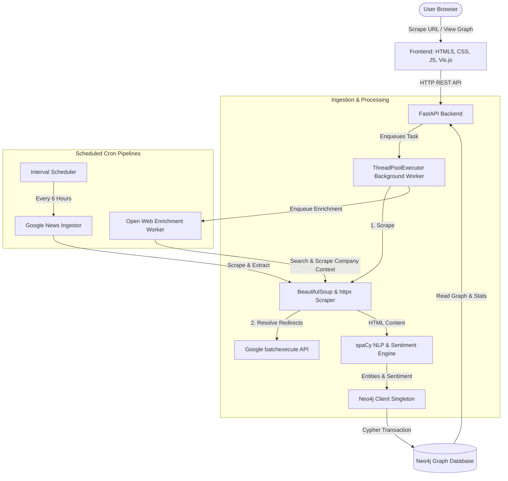

# OSINT Intelligence Engine 🕸️🤖

An automated, dockerized OSINT (Open Source Intelligence) pipeline that scrapes web articles, resolves redirect chains, extracts entities (People, Companies, & Locations) and sentiment polarities using Natural Language Processing (NLP), and maps their relationship networks in a dynamic Neo4j Graph Database.

---

## 🌟 Features

*   **Robust Web Scraper & URL Resolver:** 
    *   **Anti-Blocking measures:** Employs random User-Agent rotation from a standard browser agent pool and custom HTTP headers.
    *   **Google News Redirect Resolution:** Automatically resolves internal JavaScript/meta-refresh Google News redirect URLs (`news.google.com/rss/articles/...`) to the original publishers' URLs (e.g. NBC, CNN, BBC) using Google's internal `batchexecute` API endpoints before scraping.
    *   **Layout Sanitization:** Automatically decomposes scripts, styles, navs, footers, headers, asides, forms, iframes, and noscript wrappers.
    *   **Main Content Targeting:** Searches for common container tags (like `<article>`, `<main>`, `.post-content`, etc.) to locate relevant article body text.
    *   **Fallback Ingestion:** Automatically utilizes meta description attributes (`description` or `og:description`) and raw page body extraction as backup mechanisms.
*   **NLP Entity Extraction, Sentiment & Resolution:** 
    *   **Entity Ingestion:** Uses a pre-trained **spaCy** model (`en_core_web_sm`) to classify named entities: `PERSON`, `ORG` (mapped to `Company`), and `GPE` (mapped to `Location`).
    *   **Entity Normalization:** Standardizes corporate names by removing trailing suffixes (e.g. *Inc., LLC, Ltd., Corp.*) and sanitizes formatting.
    *   **Sentiment Negation Rules:** Employs a 2-word lookback window for negation words (like *not, never, no, without, lack*) to flip adjacent sentiment polarities (e.g., *"no deficit"* resolves to positive instead of negative).
    *   **Paragraph Proximity Mapping:** Dynamically groups and maps relationships for entities mentioned inside the same paragraph (demarcated by double newlines `\n\n`) to minimize unrelated global network noise.
*   **Dynamic Data Ingestion Workers:**
    *   **Google News Feed Sync:** Features a background-scheduled ingestion worker that polls Google News top headlines every 6 hours, resolves redirects, crawls full articles, and maps them.
    *   **Open Web Enrichment:** Automatically triggers a background task for newly ingested articles to search Google News for the top 3 mentioned companies and ingests related context articles to enrich the graph network.
*   **Graph Network Storage:** Resolves entities to a schema of `Organization` (Workspace), `Article`, `Person`, `Company`, and `Location` nodes in **Neo4j**:
    *   **Connection Pool Singleton Protection:** Shares a global `Database` client singleton across all modules, scheduled cron workers, and threads, preventing connection pool exhaustion and database leaks.
    *   **Schema Enforcement:** Automatically creates and validates unique constraints for all node types (`Organization.name`, `Article.title`, `Person.name`, `Company.name`, and `Location.name`) on server startup.
    *   **Semantic Relationships:**
        *   `(:Article)-[:UNDER_WORKSPACE]->(:Organization)`
        *   `(:Person|Company|Location)-[:MENTIONED_IN]->(:Article)`
        *   `(:Person)-[:INDIRECTLY_INVOLVED_WITH]->(:Company)`
        *   `(:Person)-[:LOCATED_IN]->(:Location)`
*   **Interactive Dashboard & Pathfinder Analysis:** A premium, dark-mode dashboard featuring:
    *   **Responsive Page-Level Scroll:** The entire dashboard layouts support page-level vertical scrolling, preventing clipping on small desktop viewports, laptops, or browser zooms, while collapsing into a vertical stack on mobile/tablets.
    *   **Article Link Column:** Ingested Articles are returned with their source links, rendering a styled button to open the original publisher articles in a new tab.
    *   **Dynamic Workspace switcher:** Live workspace node, article count, and entity counts updates.
    *   **Key metrics counters:** Real-time metrics for Articles, People, and Companies.
    *   **Physics-Controlled Vis.js Network Graph:** Physics-driven node graph with customizable layouts. Automatically disables physics stabilization for small path graphs ($\le 10$ nodes) to prevent drift and lag.
    *   **High-Speed Neo4j Queries:** Optimized graph queries by splitting the Cartesian product query into separate focused queries, **speeding up load times from 1.5 minutes to under 415 milliseconds**.
    *   **Transparent Canvas Labels:** Clean edge text styling with transparent background fills and stroke outlines removed, making labels float natively on the dark canvas.
    *   **Connection Trail Narrative (Left Panel):** Traces shortest paths (up to 6 hops) and renders full-detail matching paragraphs in a scrollable blockquote list.
    *   **Floating Connection Info Box (Canvas Overlay):** A hover/click overlay box displaying concise sentence-level relationship context inside the canvas. Disables default browser tooltips for a clean, unified aesthetic.

---

## 🏗️ Architecture



---

## 🚀 Quick Start with Docker

The easiest way to run the entire stack is using **Docker Compose**, which provisions both the Neo4j Graph Database and the FastAPI backend.

### 1. Build and Start Services
From the project root directory, run:
```bash
docker-compose up --build
```

This will:
1. Initialize the Neo4j instance at `bolt://localhost:7687` (Username: `neo4j`, Password: `secure_password_123`).
2. Build the backend image, automatically download the required spaCy models, and launch the server on port `8000`.

### 2. Access the Application
*   **Interactive Dashboard:** Open your browser and navigate to [http://localhost:8000](http://localhost:8000)
*   **FastAPI Interactive Documentation (Swagger UI):** Visit [http://localhost:8000/docs](http://localhost:8000/docs)
*   **Neo4j Browser Console:** Visit [http://localhost:7474](http://localhost:7474)

### 3. Build & Run the Backend Container Standalone (Dockerfile)
If you want to build and run the backend FastAPI container independently (without Docker Compose):

*   **Build the Image:**
    ```bash
    docker build -t osint-backend -f Dockerfile .
    ```
*   **Run the Container:**
    Run the container while passing the Neo4j credentials and host URI pointing to your database instance:
    ```bash
    docker run -d -p 8000:8000 --name osint-backend -e NEO4J_URI=bolt://<neo4j-host>:7687 -e NEO4J_USER=neo4j -e NEO4J_PASSWORD=secure_password_123 osint-backend
    ```

---

## 🛠️ Local Development Setup

If you prefer to run the backend locally (outside of Docker) with a local/remote Neo4j instance:

### Prerequisites
*   Python 3.10+
*   An active Neo4j database instance

### 1. Set Up Virtual Environment
```bash
python -m venv .venv
.venv\Scripts\activate      # On Windows
source .venv/bin/activate    # On macOS/Linux
```

### 2. Install Dependencies
```bash
pip install -r requirements.txt
```

### 3. Download the spaCy NLP Model
```bash
python -m spacy download en_core_web_sm
```

### 4. Configure Environment Variables
Create a `.env` file or export the following variables in your terminal:
```env
NEO4J_URI=bolt://localhost:7687
NEO4J_USER=neo4j
NEO4J_PASSWORD=secure_password_123
```

### 5. Start the FastAPI Server
```bash
uvicorn app.main:app --reload --host 0.0.0.0 --port 8000
```

---

## 🔌 API Reference

### 🌐 Workspace Management & Stats
*   `GET /api/organizations` - Retrieves all active workspace/organization nodes.
*   `GET /api/stats?org={org_name}` - Fetches node counters (Articles, People, Companies) under a workspace.
*   `GET /api/recent?org={org_name}` - Retrieves the 20 most recently ingested articles (including source URLs).

### 🕸️ Relationship Graph & Pathfinder
*   `GET /api/graph?org={org_name}` - Generates the node-edge payload structured for vis.js rendering.
*   `GET /api/path?source={source_name}&target={target_name}` - Computes and returns the shortest path (up to 6 hops) connecting the two entities.

### 📩 Data Ingestion & Chron Jobs
*   `POST /api/scrape`
    *   **Payload:** `{ "url": "string", "org": "string" }`
    *   **Description:** Performs synchronous URL resolution and extraction, then pushes entity processing to background tasks.
*   `POST /process-news`
    *   **Payload:** `{ "title": "string", "body": "string", "org": "string" }`
    *   **Description:** Manually ingests pre-extracted text into the NLP pipeline.
*   `POST /api/cron/google-news`
    *   **Description:** Manual trigger to invoke the Google News RSS crawl, resolution, and ingestion worker in the background.

---

## 📂 Project Directory Structure

```text
intelligence-engine/
│
├── app/
│   ├── static/                 # Front-end Assets
│   │   ├── app.js              # State management, Vis.js rendering, & Article link handlers
│   │   ├── index.html          # Dashboard Layout with Responsive Grid
│   │   └── style.css           # Premium Dark Mode Theme with Page-Level Scroll
│   │
│   ├── __init__.py
│   ├── database.py             # Neo4j constraints configuration, Client Singleton, & Cypher query engine
│   ├── main.py                 # FastAPI Lifespan setup, background executors, & REST endpoints
│   ├── nlp.py                  # spaCy entity resolution & sentiment negation lookback pipeline
│   ├── scraper.py              # BeautifulSoup user-agent rotating parser & Google batchexecute redirect resolver
│   ├── google_news.py          # Google News RSS scraper worker & interval-based task scheduler
│   └── enrichment.py           # Open Web context enrichment searcher & crawler task worker
│
├── Dockerfile                  # Multi-stage production-ready build for Python app
├── docker-compose.yml          # Neo4j and Backend Orchestration
├── requirements.txt            # Python dependencies
└── README.md                   # Project Documentation
```
